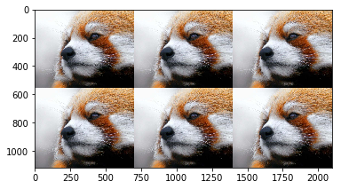

```python
import numpy as np
import cv2
import matplotlib.pyplot as plt
```

# 一、数组的创建

##  1. 创建二维数组


```python
np.array([
    [1,2,3],
    [4,6,8],
])
```


    array([[1, 2, 3],
           [4, 6, 8]])


#### *数组宽度需要一致


```python
np.array([
    [1,2,3],
    [4,6,8,7],
])
```


    array([list([1, 2, 3]), list([4, 6, 8, 7])], dtype=object)


## 2. 和python类似的range()函数


```python
np.arange(2, 6, 0.5)
```


    array([2. , 2.5, 3. , 3.5, 4. , 4.5, 5. , 5.5])


## 3. 创建元素全部为 1/0/随意/指定 的数组（ones、zeros、empty、full）


```python
np.ones(shape=(5,3))
```


    array([[1., 1., 1.],
           [1., 1., 1.],
           [1., 1., 1.],
           [1., 1., 1.],
           [1., 1., 1.]])


```python
np.ones_like(np.array([[1,2],[7,8]]))
```


    array([[1, 1],
           [1, 1]])


#### 创建不初始化的数组


```python
np.empty(shape=(3,2,2))
```


    array([[[0., 0.],
            [0., 0.]],
    
           [[0., 0.],
            [0., 0.]],
    
           [[0., 0.],
            [0., 0.]]])


####  创建数组，指定形状和填充值


```python
np.full((3,4), 5)
```


    array([[5, 5, 5, 5],
           [5, 5, 5, 5],
           [5, 5, 5, 5]])


#### 单位矩阵


```python
np.eye(5)
```


    array([[1., 0., 0., 0., 0.],
           [0., 1., 0., 0., 0.],
           [0., 0., 1., 0., 0.],
           [0., 0., 0., 1., 0.],
           [0., 0., 0., 0., 1.]])


#### 等差数列


```python
np.linspace(0, 20, num=11, endpoint=True)
```


    array([ 0.,  2.,  4.,  6.,  8., 10., 12., 14., 16., 18., 20.])


#### 等比数列


```python
np.logspace(1, 10, num=10, base=2)
```


    array([   2.,    4.,    8.,   16.,   32.,   64.,  128.,  256.,  512.,
           1024.])


##### 1. range和linspace都可以产生等差数列；
####  2. arange指定的是步长，linspace和logspace指定的是区间内数值的个数。

# 二、数组和列表

####  array采用紧凑形式存储，即直接存储数据，而不是像列表一样存储地址


#### 1. 创建数组和列表，进行时间和空间衡量

# 三、 数组运算
### 支持矢量运算（广播运算，内存对齐）


```python
a = np.array([1,2,3])
```


```python
b = np.array([
    [7,2,6],
    [6,5,4]
])
```


```python
c = 3
```

## 广播运算，对于形状不同的数组，进行扩展


```python
a+b+c
```


    array([[11,  7, 12],
           [10, 10, 10]])


```python
d = np.array([[1],[2],[3]])
```


```python
d+a
```


    array([[2, 3, 4],
           [3, 4, 5],
           [4, 5, 6]])


#### 并不是所有情况都可以广播运算，有的时候，广播也不能够形式相同


```python
np.array([1,2])+a
```


    ---------------------------------------------------------------------------

    NameError                                 Traceback (most recent call last)

    <ipython-input-1-d106fb5a0ffe> in <module>()
    ----> 1 np.array([1,2])+a
    

    NameError: name 'np' is not defined


# 四、数据类型

### 1. 指定数据类型 


```python
np.array([1, 2.3, 2], dtype=np.float32)
```


    array([1. , 2.3, 2. ], dtype=float32)


### 2. 更改数据类型


```python
a = np.array([1, 2.3, 2], dtype=np.float32)
a.astype(np.int32)
```


    array([1, 2, 2], dtype=int32)


```python
a.dtype=np.int32
a
```


    array([1065353216, 1075000115, 1073741824], dtype=int32)


```python
a = np.arange(24)
a.reshape((3,8))
```


    array([[ 0,  1,  2,  3,  4,  5,  6,  7],
           [ 8,  9, 10, 11, 12, 13, 14, 15],
           [16, 17, 18, 19, 20, 21, 22, 23]])


```python
np.reshape(a, (3, -1))
```


    array([[ 0,  1,  2,  3,  4,  5,  6,  7],
           [ 8,  9, 10, 11, 12, 13, 14, 15],
           [16, 17, 18, 19, 20, 21, 22, 23]])


# 五、 索引和切片

## 5.1 reshape可以实现维数的改变


```python
a = np.arange(12)
b=a.reshape((3,4))
b
```


    array([[ 0,  1,  2,  3],
           [ 4,  5,  6,  7],
           [ 8,  9, 10, 11]])


## 5.2 切片，返回原数组对象的视图，共享底层数据


```python
b[1:, 1:3]
```


    array([[ 5,  6],
           [ 9, 10]])


##### 切片，返回视图，如果改变底层数据，另外一个也会发生影响


```python
c = b[:]
c[0, 0] = 777
b
```


    array([[777,   1,   2,   3],
           [  4,   5,   6,   7],
           [  8,   9,  10,  11]])


##### 如果需要深拷贝，可以使用copy()


```python
c = b.copy()
c[0, 0] = 888
b
```


    array([[777,   1,   2,   3],
           [  4,   5,   6,   7],
           [  8,   9,  10,  11]])


## 5.3 数组索引

#### 传入整形索引列表，返回的是新拷贝对象


```python
index = [5, 8, 2, 7]
a[index]
```


    array([5, 8, 2, 7])


##### 创建一个bool数组，可以根据布尔数组选择元素


```python
age = np.array([15, 135, 56, 15, 65, 123, 156, 96, 61, 166, 41, 20])
a[age>50]
```


    array([1, 2, 4, 5, 6, 7, 8, 9])


#### *布尔数组元素个数必须和目标数组数量一致


```python
age1 = np.array([14, 135, 56, 35, 63, 123, 152, 96, 61, 162, 42, 20])
age1 == age
```


    array([False,  True,  True, False, False,  True, False,  True,  True,
           False, False,  True])


```python
a[age1 == age]
```


    array([ 1,  2,  5,  7,  8, 11])


```python
a[(age1 == age) &  (age>50)]
```


    array([1, 2, 5, 7, 8])


# 六、 数据扁平化

#### ravel是浅拷贝， flatten是深拷贝


```python
a = np.arange(10).reshape(2,5)
b = a.flatten()
b[0] = 777
a
```


    array([[0, 1, 2, 3, 4],
           [5, 6, 7, 8, 9]])


```python
c = a.ravel()
c[0] = 777
a
```


    array([[777,   1,   2,   3,   4],
           [  5,   6,   7,   8,   9]])


#### reshape会把原数组扁平化后，再进行结构化


```python
a = np.arange(24)
a.reshape((6,4), order='c')
```


    array([[ 0,  1,  2,  3],
           [ 4,  5,  6,  7],
           [ 8,  9, 10, 11],
           [12, 13, 14, 15],
           [16, 17, 18, 19],
           [20, 21, 22, 23]])


```python
a.reshape((6,4), order='f')
```


    array([[ 0,  6, 12, 18],
           [ 1,  7, 13, 19],
           [ 2,  8, 14, 20],
           [ 3,  9, 15, 21],
           [ 4, 10, 16, 22],
           [ 5, 11, 17, 23]])


# 七、 统计函数
* mean/sum
* max/min
* argmax/argmin
* std/ver
* consum/conprod


```python
a = np.array([
    [1,2,3],
    [8,6,1],
    [0,4,15],
    [8,52,32]
])
```


```python
a.shape
```


    (4, 3)


### 很重要的一个概念：轴


```python
a.sum(axis=0)
```


    array([17, 64, 51])


```python
a.sum(axis=1)
```


    array([ 6, 15, 19, 92])


#### 当维度扩展到多维时，统计规则：
按照指定轴下标索引的方向统计


```python
x = np.arange(24).reshape(2,3,4)
x.shape
```


    (2, 3, 4)


```python
x.sum(axis=0)
```


    array([[12, 14, 16, 18],
           [20, 22, 24, 26],
           [28, 30, 32, 34]])


```python
x.mean(axis=1)
```


    array([[ 4.,  5.,  6.,  7.],
           [16., 17., 18., 19.]])


# 八、随机函数

#### 1. 随机数


```python
np.random.rand() // 产生的区间为[0,1)
```


    0.5876140647572566


```python
np.random.rand(2,3,4)
```


    array([[[0.39923779, 0.54564034, 0.29082511, 0.55575218],
            [0.9706234 , 0.46321137, 0.53333865, 0.45499656],
            [0.59093915, 0.71118072, 0.20639271, 0.63456103]],
    
           [[0.43380432, 0.67861236, 0.90540132, 0.41274326],
            [0.33723336, 0.64989966, 0.54551242, 0.50927546],
            [0.42052748, 0.88828045, 0.63187932, 0.88410905]]])


#### 2. 标准正态分布


```python
np.random.rand(3,3)
```


    array([[0.4789705 , 0.06642018, 0.23518938],
           [0.38329877, 0.43547922, 0.28622591],
           [0.91541056, 0.04645713, 0.52973722]])


#### 3. 指定标准差和均值的正态分布


```python
np.random.normal(size=(2,3), loc=5, scale=5)
```


    array([[ 6.65254795,  4.86225972,  5.30554417],
           [ 7.78982908,  9.07412392, 16.97508793]])


#### 4. 随机整数


```python
np.random.seed(1)
np.random.randint(5, 15, size=(8,8))
```


    array([[10, 13, 14, 10,  5,  5,  6, 12],
           [11, 14,  7,  9, 10,  7,  9,  7],
           [ 9, 12, 12, 14,  6, 12,  5, 11],
           [14, 14, 12, 11, 14,  6,  5,  6],
           [13, 13,  8, 14, 13, 12,  8, 11],
           [10,  6, 14,  8,  9, 13,  6,  9],
           [ 5,  8, 14,  7,  5,  9, 14,  7],
           [12, 12, 14, 13, 11, 14,  8, 12]])


```python
np.random.seed(1) // 设定相同的种子
np.random.randint(5, 15, size=(8,8))
```


    array([[10, 13, 14, 10,  5,  5,  6, 12],
           [11, 14,  7,  9, 10,  7,  9,  7],
           [ 9, 12, 12, 14,  6, 12,  5, 11],
           [14, 14, 12, 11, 14,  6,  5,  6],
           [13, 13,  8, 14, 13, 12,  8, 11],
           [10,  6, 14,  8,  9, 13,  6,  9],
           [ 5,  8, 14,  7,  5,  9, 14,  7],
           [12, 12, 14, 13, 11, 14,  8, 12]])


```python
import random
a = random.randrange(5, 15)
b = random.randint(5, 15)
a,b
```


    (13, 9)


#### 5. 洗牌


```python
a = np.arange(10)
np.random.shuffle(a)
a
```


    array([0, 7, 1, 3, 8, 2, 9, 5, 4, 6])


#### 6. 产生随机小数[a, b)


```python
np.random.uniform(2.1, 5.2)
```


    2.816147808859026


# 九、 连接和拆分


```python
a = np.arange(12).reshape(3,2,2)
b = np.arange(12, 24).reshape(3,2,2)
c = np.concatenate((a,b), axis=2)
c
```


    array([[[ 0,  1, 12, 13],
            [ 2,  3, 14, 15]],
    
           [[ 4,  5, 16, 17],
            [ 6,  7, 18, 19]],
    
           [[ 8,  9, 20, 21],
            [10, 11, 22, 23]]])


```python
np.split(c, 2, axis=2)  // 切割数量必须能整除，
```


    [array([[[ 0,  1],
             [ 2,  3]],
     
            [[ 4,  5],
             [ 6,  7]],
     
            [[ 8,  9],
             [10, 11]]]), array([[[12, 13],
             [14, 15]],
     
            [[16, 17],
             [18, 19]],
     
            [[20, 21],
             [22, 23]]])]


```python
np.split(c, [3,], axis=2) // 还可以通过列表指定拆分位置，效果如[0-2][3-最后]  
```


    [array([[[ 0,  1, 12],
             [ 2,  3, 14]],
     
            [[ 4,  5, 16],
             [ 6,  7, 18]],
     
            [[ 8,  9, 20],
             [10, 11, 22]]]), array([[[13],
             [15]],
     
            [[17],
             [19]],
     
            [[21],
             [23]]])]


# 十、其它函数


```python
a = np.arange(24).reshape(6,4)
a.any()
```


    True


```python
a.all()
```


    False


#### 转置(颠倒下标)


```python
a
```


    array([[ 0,  1,  2,  3],
           [ 4,  5,  6,  7],
           [ 8,  9, 10, 11],
           [12, 13, 14, 15],
           [16, 17, 18, 19],
           [20, 21, 22, 23]])


```python
a.T
```


    array([[ 0,  4,  8, 12, 16, 20],
           [ 1,  5,  9, 13, 17, 21],
           [ 2,  6, 10, 14, 18, 22],
           [ 3,  7, 11, 15, 19, 23]])


####  **轴变换**


```python
a = np.arange(24).reshape(2,3,4)
a.transpose(2,0,1) 
```


    array([[[ 0,  4,  8],
            [12, 16, 20]],
    
           [[ 1,  5,  9],
            [13, 17, 21]],
    
           [[ 2,  6, 10],
            [14, 18, 22]],
    
           [[ 3,  7, 11],
            [15, 19, 23]]])


# 十一、 运算

## 1. 乘法


```python
a = np.arange(24).reshape(6,4)
b = np.arange(24).reshape(4,6)
c = 5
d = np.arange(4).T
```


```python
np.dot(a,c)
```


    array([[  0,   5,  10,  15],
           [ 20,  25,  30,  35],
           [ 40,  45,  50,  55],
           [ 60,  65,  70,  75],
           [ 80,  85,  90,  95],
           [100, 105, 110, 115]])


#### 点积(dot 和 @)


```python
np.dot(a, b)
```


    array([[  84,   90,   96,  102,  108,  114],
           [ 228,  250,  272,  294,  316,  338],
           [ 372,  410,  448,  486,  524,  562],
           [ 516,  570,  624,  678,  732,  786],
           [ 660,  730,  800,  870,  940, 1010],
           [ 804,  890,  976, 1062, 1148, 1234]])


```python
a@d
```


    array([ 14,  38,  62,  86, 110, 134])


```python
a = np.arange(24).reshape(2,3,4)
b = np.arange(24).reshape(2,4,3)
a@b
```


    array([[[  42,   48,   54],
            [ 114,  136,  158],
            [ 186,  224,  262]],
    
           [[ 906,  960, 1014],
            [1170, 1240, 1310],
            [1434, 1520, 1606]]])


## 注意：a的最后一维和b的倒数第二维长度相同才能点积


```python
(a@b).shape
```


    (2, 3, 3)


# 十二、 排序
 * np.sort()     返回新对象
 * 对象.sort()   就地修改


```python
x = np.array([1,43,5,7,3,43,43])
```

#### np.sort(对象)返回新对象


```python
y = np.sort(x)
y
```


    array([ 1,  3,  5,  7, 43, 43, 43])


```python
x
```


    array([ 1, 43,  5,  7,  3, 43, 43])


#### 对象运用排序方法，返回原对象


```python
x.sort()
x
```


    array([ 1,  3,  5,  7, 43, 43, 43])


#### unique() 去重 & 排序


```python
np.unique(x)
```


    array([ 1,  3,  5,  7, 43])


#### 三目运算


```python
a = np.array([1,  3,  5,  7, 43])
b = np.array([4,  2,  56,  2, 1])
np.where(a>b, a, b)
```


    array([ 4,  3, 56,  7, 43])


#### i/o操作


```python
a = np.arange(24).reshape(2,3,4)
```


```python
np.save("./" ,a)
```


```python
result = np.load("./.npy", )
result
```


    array([[[ 0,  1,  2,  3],
            [ 4,  5,  6,  7],
            [ 8,  9, 10, 11]],
    
           [[12, 13, 14, 15],
            [16, 17, 18, 19],
            [20, 21, 22, 23]]])


## 练习，读取图像


```python
a = plt.imread('/home/geoffrey/图片/baidu.png')
```


```python
a.shape
```


    (258, 540, 4)


```python
plt.imshow(a)
plt.show()
```


```python
result = np.split(a, 3)
```


```python
img_black = np.full((500, 500),fill_value=255,  dtype=np.uint8)
```


```python
img_black
```


    array([[255, 255, 255, ..., 255, 255, 255],
           [255, 255, 255, ..., 255, 255, 255],
           [255, 255, 255, ..., 255, 255, 255],
           ..., 
           [255, 255, 255, ..., 255, 255, 255],
           [255, 255, 255, ..., 255, 255, 255],
           [255, 255, 255, ..., 255, 255, 255]], dtype=uint8)


```python
cv2.imshow('', img_black)
cv2.WaitKey(0)
```


    ---------------------------------------------------------------------------

    AttributeError                            Traceback (most recent call last)

    <ipython-input-26-700b93714854> in <module>()
          1 cv2.imshow('', img_black)
    ----> 2 cv2.WaitKey(0)
    

    AttributeError: module 'cv2.cv2' has no attribute 'WaitKey'


```python
plt.imshow(img_black)
```


    <matplotlib.image.AxesImage at 0x7f544658d128>


# 练习

## 1. 转换为灰度图
灰度图的数据可以看成是二维数组，元素取值为0 ~ 255，其中，0为黑色，255为白色。从0到255逐渐由暗色变为亮色。  
灰度图转换（ITU-R 601-2亮度变换）：  
L = R \* 299 / 1000 + G \* 587 / 1000 + B \* 114 / 1000  
R,G,B为最低维的数据。  
显示灰度图时，需要在imshow中使用参数：  
`cmap="gray"`  


```python
import numpy as np
import cv2
import matplotlib.pyplot as plt
from PIL import Image
```


```python
import numpy as np

def get_color_channels(img):
    img = img.copy()
    channels_num = len(img.shape)
    result = []
    
    channels = np.split(img, channels_num, axis=2)
    for i in channels:
        result.append(i.sum(axis=2)) 
    return result
```


```python
# img = cv2.imread('/home/geoffrey/图片/小熊猫.png')
img = Image.open('/home/geoffrey/图片/小熊猫.jpeg')
img = np.array(img)
```


```python
# img.transpose(0,1,2) 
plt.imshow(img)
plt.show()
```


```python
img.shape
```


    (559, 700, 3)


```python
R, G, B, = get_color_channels(img)
```


```python
R.shape
```


    (559, 700)


```python
w = np.ones((500,500,3))
plt.imshow(w)
plt.show()
```


```python
w = np.zeros(shape=(500,500,3), dtype=np.uint8)
plt.imshow(w)
plt.show()
```


```python
w = np.full(shape=(500,500,3), fill_value=125 , dtype=np.uint8)
w[:] = [0,238,225] # 广播操作
plt.imshow(w)
plt.show()
```


```python
L = R * 299 / 1000 + G * 587 / 1000 + B * 114 / 1000  
plt.imshow(L, cmap="gray")
plt.show()
```


```python
temp = np.array([ 0.299,  0.587, 0.114])
plt.imshow(img@temp, cmap="gray")
plt.show()
```


```python
w = np.zeros(shape=(500,500,3), dtype=np.uint8)
plt.imshow(w)
plt.show()
```


```python
plt.imshow(L.T, cmap="gray")
plt.show()
```


```python
test1 = np.array([
    [1,0],
    [0,1]
])
```


```python
# img.transpose(0,1,2) 
plt.imshow(img)
plt.show()
```


```python
B_img = img.copy()
B_img[:,:, [0,1]]=0

R_img = img.copy()
R_img[:,:, [0,2]]=0

G_img = img.copy()
G_img[:,:, [2,1]]=0
```


```python
fig,ax = plt.subplots(2,2)
# 
ax[0,0].imshow(img)
ax[1,1].imshow(R_img)
ax[1,0].imshow(G_img)
ax[0,1].imshow(B_img)
fig.set_size_inches(15, 15)
plt.tight_layout()
plt.show()
```


```python
t1 = np.concatenate((img, img, img), axis=1) # 横向拼接
t2 = np.concatenate((t1, t1), axis=0)

plt.imshow(t2)
plt.show()
```





#### 水平镜像 --- 交换行


```python
mirrow_img_x = img[::-1]
plt.imshow(mirrow_img_x)
plt.show()
```


#### 水平翻转 --- 交换列


```python
mirrow_img_y = img[:,::-1]
plt.imshow(mirrow_img_y)
plt.show()
```


#### 调换x,y坐标


```python
plt.imshow(img.transpose(1,0,2))
plt.show()
```


```python
plt.imshow(img.transpose(1,0,2)[::-1])
plt.show()
```


```python
test = img[:, :, [2,1,0]]
plt.imshow(test)
plt.show()
```


```python
k = np.random.randint(0, 256, size=(200, 200, 3), dtype=np.uint8)
test = img.copy()
test[300:500,400:600] = k
plt.imshow(test)
plt.show()
```


```python
t = img.copy()
height=t.shape[0]

li = np.split(t, range(100, height, 30), axis=0)
np.random.shuffle(li)
t = np.concatenate(li, axis=0)
plt.imshow(t)
plt.show()
```


```python
t = img.copy()

plt.imshow(t[:,:,[2,0,1]])
plt.show()
```


```python

```
